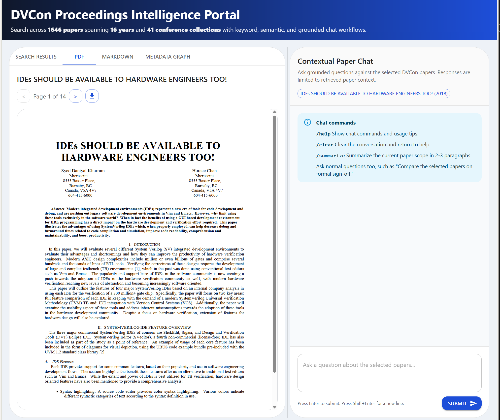

# DVCon Paper RAG Web App

Professional full-stack search and chat application for the DVCon proceedings archive.

## Features

- Downloads DVCon paper PDFs into `data/paper/`
- Extracts markdown, images, and metadata into `data/`
- Enriches title, abstract, authors, affiliations, and bibliography with a local GROBID sidecar by default
- Indexes the corpus for keyword and semantic retrieval
- Supports paper-scoped chat with the OpenAI Responses API
- Provides PDF, markdown, metadata graph, and chat workflows in a React web UI



## Local run

### Backend

```bash
./scripts/start_backend.sh
```

`start_backend.sh` now brings up the local GROBID sidecar automatically before starting FastAPI.
`start_grobid.sh` waits for the GROBID liveness endpoint on `8070` before returning.

### Frontend

```bash
./scripts/start_frontend.sh
```

### Both

```bash
./scripts/start_all.sh
```

### Windows PowerShell

```powershell
.\scripts\start_all.ps1
```

Both `start_backend.ps1` and `start_all.ps1` start the local GROBID sidecar automatically.

### GROBID sidecar only

```bash
docker compose up -d grobid
```

The sidecar exposes:

- `http://127.0.0.1:8070` for the main GROBID API
- `http://127.0.0.1:8071` for the admin/health port

## Docker

### Full stack with Docker Compose

Run both the app container and the GROBID sidecar together:

```bash
docker compose up --build
```

This is now the default container runtime path. The app service reads `.env`, mounts `${DATA_DIR:-data}` into `/app/${DATA_DIR:-data}`, waits for GROBID readiness before starting, and points `GROBID_URL` at the internal `grobid` service automatically.

By default, Docker Compose publishes the app on `http://127.0.0.1:8011` so it does not collide with the existing local backend on `8010`. You can override this with `APP_HOST_PORT`.
If your Docker installation uses the legacy CLI, `docker-compose up --build` is equivalent.

Build the image:

```bash
docker build -t dvcon-paper-rag .
```

Run the container (the app listens on its internal `PORT`, default `8000`; map it to a host port of your choice):

```bash
docker run --rm -p 8010:8000 --env-file .env dvcon-paper-rag
```

Then open `http://localhost:8010`.

If you want the app container to use a host-managed GROBID sidecar instead of Compose, add:

```bash
docker run --rm -p 8010:8000 --env-file .env -e GROBID_URL=http://host.docker.internal:8070 dvcon-paper-rag
```

## Ingestion

Run a small test ingest:

```bash
uv run --project backend ingest --limit 5
```

The ingestion pipeline always produces markdown and extracted images through `PyMuPDF` / `pymupdf4llm`. When GROBID is enabled and reachable, it additionally enriches:

- title
- abstract
- structured authors
- affiliations
- bibliography / references

Raw TEI XML is stored at `data/tei/{year}/{location}/{slug}.tei.xml`.

## Environment

Copy `.env.example` to `.env` and provide:

- `OPENAI_BASE_URL`
- `OPENAI_API_KEY`
- `OPENAI_CHAT_MODEL`
- `APP_HOST_PORT`
- `DATA_DIR`
- `GROBID_ENABLED`
- `GROBID_URL`
- `GROBID_TIMEOUT_SECONDS`
- `LOCAL_EMBEDDING_MODEL`
- `LOCAL_EMBEDDING_DEVICE`

Semantic search uses a local sentence-transformer model, not the OpenAI API, and will prefer CUDA when available.
The default local embedding model in the repo config is `BAAI/bge-m3`.
The default chat model is now `gpt-5-mini`.

GROBID is enabled by default. If it is disabled or unavailable, the extractor falls back to the existing heuristic metadata path and still writes markdown and images normally.

## MCP server and agent access

The same paper search, detail, markdown, graph, stats, and grounded chat capabilities are also exposed as a Model Context Protocol (MCP) server over stdio transport, so MCP-compatible agent clients (Claude Code, ZCode, Cursor, etc.) can query the corpus as tools without going over HTTP.

Start the MCP server (read tools work without GROBID or OpenAI; the chat tool needs the OpenAI keys):

```bash
./scripts/start_mcp.sh      # or: uv run --project backend dvcon-mcp
```

The server exposes six tools — `search_papers`, `get_paper_detail`, `get_paper_markdown`, `get_paper_graph`, `corpus_stats`, and `chat_with_papers` — all backed by the existing service layer in `backend/src/backend/`.

There is also an agent skill at `.agents/skills/dvcon-papers/SKILL.md` describing when and how to use these tools. Discover it with `/skill dvcon-papers` in a ZCode-style client.

### Anthropic Claude marketplace

A Claude Code plugin marketplace ships at `.claude-plugin/marketplace.json` with one plugin, `dvcon-papers`, which bundles the skill, a `/dvcon` slash command, and the MCP server. Add the marketplace and install it from a Claude Code session:

```
/plugin marketplace add hevangel/dvcon_ai_library
/plugin install dvcon-papers@dvcon-marketplace
```

See `AGENTS.md` for the full MCP tool surface and plugin layout.

## Current Local Test Corpus

The current local test corpus was reset and rebuilt from scratch with `10` indexed papers from event year `2025`, then later extended with `8` Horace Chan papers through `2022`.
The repo also now includes a checked-in sample corpus under `data.example/` containing the 8 Horace Chan papers plus their extracted PDFs, markdown, TEI, and image assets.

If you switch embedding models on an existing corpus, run a forced ingest so Chroma is rebuilt for the new vector dimension.

## Troubleshooting

If the app starts acting like a hardware bug disguised as a software bug, open your favorite AI detective and make it explain itself. Use `Cursor`, `GitHub Copilot`, `Claude Code`, or `Codex`, but only use the latest and greatest model, don't waste your time on inferror cheaper model.

## Contributing

Please see `CONTRIBUTION.md` for contribution expectations, issue filing, and fork + pull request workflow.
