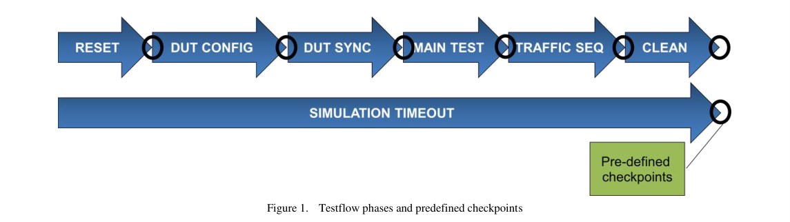
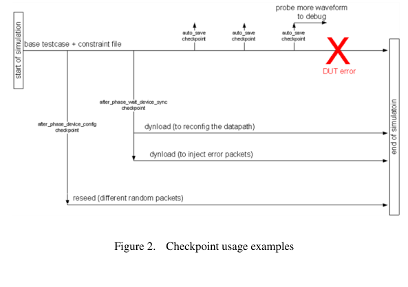

# **Can You Even Debug a 200M+ Gate Design?**


Deepali Joshi

PMC-Sierra
8555 Baxter Place,

Burnaby, BC
Canada, V5A 4V7

604-415-6000


Corey Goss,

Cadence,
1130 Morrison Dr,

Kanata, ON
Canada, K2H 9N6

613-828-5626


Horace Chan

PMC-Sierra
8555 Baxter Place,

Burnaby, BC
Canada, V5A 4V7

604-415-6000


Brian Vandegriend

PMC-Sierra
8555 Baxter Place,

Burnaby, BC
Canada, V5A 4V7

604-415-6000


_**Abstract**_ **—Verification debug consumes a large portion of the**
**overall project schedule, and performing efficient debug is a key**
**concern in ensuring projects tape out on time and with high**
**quality.  In this paper, we outline a number of key verification**
**debug challenges we were faced with and how we addressed**
**them using a combination of tools, technology and methodology.**
**The root cause of failures can be traced, most often, to either an**
**issue in the RTL, an issue in the testbench or, in our case, the**
**software interacting with the hardware. Speeding the debug**
**turnaround time (the time to re-run a failing sim to replicate the**
**issue for debug) is critical for efficient debug. Periodic saving**
**of the simulation state was utilized extensively to narrow the**
**debug turnaround time to a very small window. Once a re-run**
**was launched, waveform verbosity levels could be set by users to**
**dump the appropriate amounts of information for debug of the**
**re-run scenario. For additional performance on the testbench**
**side, coding methodology was introduced that allowed for**
**maximum performance of stable sections of code. To speed SW**
**debug, a software driver was implemented into the testbench to**
**allow for debug of SW related issues very early on in the project.**


_**Keywords: Debug, e, Specman, Dynamic Load, Save/Restore,**_
_**Software Debug, HW-SW Co-debug, OOP, Testflow**_


I. INTRODUCTION

Verification of a two hundred million gate design, which is
four times the size of our previous design, presents numerous
challenges. In addition to the many other challenges that
came with a design this size we knew that debug would be a
significant issue that needed to be addressed from the project
outset. In particular, the debug turnaround time (TAT), the
time taken to re-run a failing test to get to the point of debug,
would need to be reduced. From experience, we knew
simulations would typically run for several hours each and we
could not afford to spend an entire engineer’s day re-running a
failing test just to start debug. What we needed was method
to reproduce a failing scenario using significantly less
simulation cycles,. Since our design size was very large,
performance was a key concern. We realized early on that
we needed more than just raw simulation speed. We needed to
examine the way we planned, developed and managed our
code base throughout the project to optimize performance.
Methodology, as well as technology would play a key role in
enabling us to debug more efficiently. As OOP testbenches
today more closely resemble complex software systems,
interactive debug would play a key role in speeding our overall
debug turnaround time. Rather than sifting through post


process log and wave information, interactive debug features
such as single stepping, usage of watch windows and
breakpoint setting would allow us to get close to the point of
failure more quickly, and visualize all needed debug
information at the point of failure. Interactive debug also
allowed us to reduce the amount of information we needed to
save for each simulation debug run since when running
interactively, all variables are available through the simulator.
On the coding side we needed to implement an environment
from the ground up that was crafted with debug TAT in mind.
Since we were _**e**_ users, this meant examining ways to partition
the code base into compiled versus interpreted code early on in
our project.


Before beginning our project, we surveyed existing papers
and articles on a variety of debug topics. In [1], the idea of
utilizing save and restore technology paired with a testflow
infrastructure is discussed however; the example utilizes
SystemVerilog as the implementation language. As we were
using an in-house developed testflow, this reference was quite
relevant and we can adapt the idea in the paper in _**e**_ . In [2]
,[3] and [4] further details on the specifics of how to pair the
save and restore functionality, together with reseeding and, for
e users such as ourselves, the dynamic loading of additional
files after a restore point is addressed. These papers helped us
to understand some of the specifics around the save/restore
flows supported and the benefits/limitations we might
encounter. The save/restore scheme we implemented was
based around previous successes we had using basic
save/restore on previous projects, supplemented with the latest
features (dynamic loading and reseeding) available. While
we found a number of papers related to debug for review, we
found that we had enough experience in-house to understand
the path we needed to take to achieve our goals in terms of
code infrastructure changes and integration of our SW driver
into the overall testbench infrastructure.


This paper is structured in two major sections: 1)
speeding the debug TAT of RTL and, 2) speeding the debug
TAT of testbench and software. We will discuss what
worked well and also identify a few items that did not work
out.


II. SPEEDING THE DEBUG TURNAROUND TIME FOR RTL


_A._ _Saving and loading checkpoint snapshots_


Since our design was datapath oriented and we would be
working with very large OTN frames, we knew from
experience that simulations were going to be lengthy. Sending
a single frame of data could take up to 10 minutes of wall
clock time. Due to this, simulations would typically run for
several hours and some simulations would even take several
days to complete. In the event of a failure, re-running the
complete simulation from time 0 for debug could consume an
entire engineer’s day. As failures typically take several
iterations to isolate and correctly identify the bug, re-running
simulations from time 0 would be unacceptable and extremely
inefficient. We needed to replicate failure scenarios in much
shorter timeframes. We set as goal that we wanted to be able to
re-run any failing simulation and return to the point of failure
in no more than thirty minutes. Thirty minutes would allow
many re-runs in a single day. To achieve this, we made
extensive use of the save/restore functionality common in
today’s simulators. We introduced a methodology within our
simulation run environment that, by default, saved a
checkpoint every 30 minutes or 10,000ns of simulation time,
whichever is more frequent. The continuous checkpoint
saving was implemented behind the scenes such that users did
not need to set anything specific within their simulation in
order to benefit. To save on disk space, the same checkpoint
file was continuously overwritten throughout the simulation in
a directory location unique for each test run. Whenever a
failure occurred, users could quickly restore the last saved
checkpoint knowing that it would take, at most, 30 minutes to
replicate their failing scenario.


Our implementation of checkpoint saving allowed users to
have flexible controls over how often a checkpoint was saved.
Users should avoid saving checkpoints too often since too
much disk operation in the simulator may cause performance
bottlenecks depending on the network infrastructure. For
example, it takes on average 30 seconds to save a 4G snapshot
with average network load. The time required to save a
snapshot increase as the size of the snapshot and load of the
network. We implemented five different mechanisms:


_once and the environment setup would consider these for all_
_cases._

```
%> set CP_SIMTIME = 100000; # in ns
%> set CP_REALTIME = 1800; # in seconds

```

_2)_ _Run script command line inputs. This allowed users to_
_override the default values set in the environment variables_
_for a single simulation run when debugging the testcase._
_The run script is a shell script that wraps around the ncsim_
_command and allow us to easily modify any ncsim argument._
_The run script will overwrite the environment variable with_
_the input arguments before launching ncsim._

```
%> do_sim.cmd –cp_simtime 100000

```

_3)_ _Manually saving the checkpoint from the simulator_
_command line. When the user is running the simulator in_
_interactive mode, they could create an instantaneous_
_checkpoint right from the ncsim command line. This was_
_very helpful in reducing the debug turnaround time even_
_further since if a user was able to get to a point in the_
_simulation that was only a few cycles before a failure, they_
_could create an instantaneous snapshot at that point, reducing_
_the debug turnaround time from 30 minutes down to several_
_minutes and, in some cases, seconds. For example:_

```
ncsim> save_checkpoint [checkpoint_name]

```

_4)_ _Constraints embedded within the testcase. This_
_allowed users to set constraints within the testcase code itself_
_that would always be adhered to, no matter how the test was_
_launched or what environment variables were set. Below is an_
_example of the code required to be included in the testcase to_
_control the timing parameters._

```
extend checkpoint_utils {
keep cp_simtime == 100000; // in ns

```





_1)_ _Envrionment variables. The user can set environment_
_variables to be picked up by the simulation run scripts_
_automatically. This allowed users to set their own_
_checkpoint timing parameters in their testbench that would be_
_used every time a simulation was run. Users could set it_


```
keep cp_realtime == 1800; // in seconds
};

```

_5)_ _Hardcoded function call in the testcase. If the user_
_knows ahead of time where in the testcase they would like to_
_save a checkpoint, for example after the testbench sent in the_
_10th frame, they can hardcode the testcase to call an e_


_method to save the checkpoint. Doing so, the user does not_
_have to guess how long the simulation has to run before the_
_checkpoint is saved. Below is an example of the code:_

```
for i from 0 to 20 {
do send_frame_seq; // send frame sequence
if (i == 10) {
sys.checkpoint_util.save_checkpoint(
“sending_10th_frame”); // checkpoint name
};
} ;

```

We also needed to consider the location of where
checkpoint files would be saved. While a natural place to do
this would be within the snapshot directory of the simulator
(this is the default location for the simulator), this was not
optimal for our purposes. The reason being, when running
regressions, we shared simulation snapshots across 100’s (even
1000’s) of simulation runs. Since each checkpoint could take
several gigabytes of disk space depending on the size of the
elaborated snapshot, a single snapshot directory could
potentially become unmanageable in size. Instead,
checkpoints were saved to test-specific directories outside of
the snapshot. The directory name was made unique through a
combination of the testcase name, the seed value and the times
stamp of when the simulation was launched.


Once snapshots were saved, users could quickly load
any of the saved snapshots through a custom implemented
command, which is essentially a wrapper of the standard ncsim
restart command with additional code to resolve the
checkpoint snapshot directory from the testcase name, the seed
value, etc. The command could be executed on either the
ncsim simulator command line interactively or executed from
the tcl script input to ncsim. The command is as follows:

```
ncsim> load_checkpoint [checkpoint_name]

```

Loading a saved checkpoint snapshot allowed users to
quickly replicate failures through restoring the last checkpoint
and re-running, reducing our debug TAT to, at most, a 30
minute window. As you can see from the above control
mechanisms, the TAT could be reduced to as small a window
as the user desired. This methodology was also extended to
our regression re-run strategy where, if ever a failure occurred,
VManager (a verification management tool) would
automatically re-run the last saved checkpoint, with additional
waveform dumping and increased verbosity in the log file.
Since our average top level simulations typically took 6 hours
before a failure, implementing this methodology resulted in a
90% reduction in simulation time required to replicate bugs.
As a result, we were able to run more debug iterations in a
shorter amount of time.


_B._ _Dynamic Load Additional Code at Saved Checkpoints_

One of the unique features in Specman/ _**e**_ is the ability to
load additional testcase code after restoring from a checkpoint
snapshot. The paper [3] outlined a framework of saving
predefined checkpoints after each key phase in the testflow.
This allowed us to launch new tests at key points in the
simulation, bypassing uninteresting or redundant start up


conditions. Figure 1 displays some of the key phases in the
testflow, as well as the predefined checkpoints.


After loading any of the checkpoints, we could
dynamically load additional testcase code and/or reseed the
simulation so as to change the results of all future
randomization actions. Loading additional code allowed us
to test bug fixes and try various “what if” scenarios by layering
additional constraints, injecting error packets and configuring
the DUT slightly differently to better identify and isolate bugs.
Furthermore, dynamic load allowed us to code, load and test
sequences that replicated the specific traffic that led to the bug.
These sequences were then added to the regular regression to
increase the robustness of the test suite.


For example, if it takes 3 hours of simulation time to
configure the device and wait for the device to stabilize before
we start to inject interesting traffic scenarios to stress test
corner cases. If we have to inject 10 different traffic
scenarios using 10 different traffic sequences, all using
identical configurations, in the past we would have to run the
simulation 10 times from the time zero. With the help of
dynamic load, we can save a checkpoint after the device is
stabilized, then use dynamic load to augment the testcase with
new sequence code that change traffic scenarios. It saved us
9x3 or 27 hours in simulation time assuming there is no bug in
the traffic sequences. If we have to debug the traffic
sequences, we don’t have to wait for 3 hours before knowing
whether or not the sequence works. Using dynamic load
capabilities, we can restore a checkpoint and run with new
loaded code, seeing the effects of our new additions
immediately.


_C._ _Waveform Verbosity_

Implementing various messaging verbosity levels within
testbenches is a fairly common practice and one that we were
familiar with from previous projects. When re-running a
failing simulation for debug, it is common to increase the
verbosity of the messages so as to provide more information to
the log file. We extended the verbosity concept into
waveform probing, allowing us to set various levels of
waveform verbosity in the testbench and in the testcase.
Probing a large number of signals not only takes up lots of disk
space, but also slows down the simulation. From our
experience, probing the full hierarchy of the device could
make the simulation run up to 10 times slower. We defined
the waveform verbosity level guidelines following the message
verbosity level guidelines. The amount of signals probed at
each level is was as follows:


_1)_ _NONE: No waveform is probed_
_2)_ _LOW: Probe all the ports of the module_
_3)_ _MEDIUM: Probe all the internal signals of the module_
_4)_ _HIGH: Probe the memories and variables of the_
_module_

_5)_ _FULL: Probe delta cycle changes of the signals_


The waveform verbosity was implemented using a tcl
procedure wrapped around the standard ncsim probe command
to filter out the probe command with the verbosity level.
Users could set the verbosity level in run script argument, for
example:


```
%> do_sim.cmd –wave_verbosity low

```

The run script saved the verbosity level for the simulation
run in a shell variable. Then in the testcase, the user must call
the wrapper procedure instead of calling the ncsim probe
command directory, for example:

```
add_probe –verbosity medium top.dut –depth all

```

The following is the code fragments of an example tcl
wrapper implementation. Due to the limit of space in the
paper, we are omitting the part that parses the arguments to
determine the verbosity value.

```
proc add_probe args {
set verbosity_list “none low medium high full”

# parse the argument list and remove
# –verbosity from $args

if {[lsearch $verbosity_list $env(SIM_VERBOSITY)] >=
[learch $verbosity_list $verbosity]} {

eval probe $args
}
}

```

Figure 2 illustrates how the auto-save chekpointing,
built-in checkpoints and waveform verbosity capabilities work
together to allow for rapid debug TAT. When a DUT error
occurs, the user needs only reload the last auto saved
checkpoint to quickly get to the point of failure. The
messaging and waveform verbosity can be increased when the
simulation is restored so as to provide additional waves and


messages for debug. If the user would like to reseed and/or
dynamically load additional files, they can select one of the
predefined checkpoints to restore from.


III. SPEEDING THE DEBUG TURNAROUND TIME FOR

TESTBENCH AND SOFTWARE


_A._ _Incremental Compile of the Specman Testbench_

Many languages such as SystemVerilog, VHDL and
Verilog operate in compiled mode only. The _**e**_ language is


able to be run in either compiled mode or interpreted mode,
and each mode has benefits and tradeoffs.  Interpreted e
code has all of the capabilities needed for full debug, but the
runtime performance is typically 3X slower than compiled
code. Compiled e code runs much faster than interpreted e
code, due to the optimizations that remove some of the debug
capabilities. To improve on simulation performance while
still allowing debug control, we incorporated a strategy of
partitioning our testbench such that the stable pieces of e code
were added to a list of compiled files (to maximize speed)
while the more unstable code remained loaded interpretively
(to maximize debug). This required careful up front planning
as there would be considerable interaction between compiled
code (limited debug) and interpreted code (full debug) and we
needed the right level of debug available to us.  To facilitate
this strategy from the very beginning of our project, we arrived
at 3 key rules to implement our testbench code:


_1)_ _Header files were used for struct/unit definitions and_
_instantiation of the testbench only: This allows for clear_
_separation of the object declaration from the definition. The_
_declaration of the objects (fields, method signatures, etc.) can_
_be compiled for optimal performance almost as soon as they_
_are written. The definition of the object (additional field_
_declarations and method extensions) can be loaded_
_interpretively while the code was being developed and then_
_compiled once stable. This rule also helps to remove any_
_cyclic imports._


_2)_ _A sequence is something special and there should be no_
_more than one per file: In our environment, sequences were_
_loaded into each test on an as needed basis. This allowed us_
_to cut down on the amount of code we needed to load and to_
_save time when running tests as we did not need to load entire_
_sequence libraries unnecessarily. It also simplified revision_
_control._


_3)_ _Do not mix hard constraints together with header files:_
_As constraints can vary, we made sure not to include any hard_
_constraints within the header files. All constraints within the_
_header files should have the ability to be overwritten, which_
_means they should either be soft constraints or named_
_constraints._


Header files formed the bulk of our compiled code list.
New sequences were created and debugged as interpreted files
and then, once they became stable, they were migrated to the
compiled code list. Constraints resided mainly in test files,
which are typically loaded interpretively throughout the
project. Using the above coding guidelines, we were able to
maximize our debug turnaround time for testbench code by
running the maximum amount of e code in compiled mode.
Since compiled e code typically runs three times faster than
interpreted code, the speedup was significant. On average the
testbench code running in interpreted mode uses about 15% of
CPU cycles in the simulation. Switching over to compiled e
code cut the CPU usage of the testbench down to 5%, which
translates to almost a 10% speed up in the total simulation
time.



As an experiment to further speed up the simulation, we
considered compiling all constraints and sequences once they
became stable. However since the bulk of the loaded code
contained only constraints, we did not achieve much speed up
and, in the end decided to leave the constraint (mainly tests) as
interpreted files.


The following example demonstrates the import structure
of our testbench that support incremental compile in Specman.

```
testcase.e :
import testbench_top.e;
import <sequences required by the testcase>;
// set constraint to fine tune the sequences;

testbench_top.e;
import testbench_compile_full.e;
// import unstable testbench code

testbench_compile_full.e:
import testbench_compile_base.e;
// import stable testbench code

testbench_compile_base.e:
// import VIP UVCs
 // import testbench header files

```

_B._ _Software/hardware Co-verification_

When our design is used within a real system, software
controls and configures the device. In the past, integration of
the software and hardware typically did not take place until the
device was returned back to the lab. Once in the lab, it would
then take at least a week for the software driver to be
debugged, the configuration sequence to be created and
communication to be established. Given the large gate count
of our device and the amount of software code required to
configure it, we wanted to enable an even faster bring up time
in the lab for our software team and, even better, to allow the
software team to run a limited set of tests on the HDL itself.
To enable this, our top level system simulations involved
interaction with a newly developed software driver written in
C code. In order to facilitate HW/SW co-debug, we needed
the ability to interactively debug hardware (Verilog and
VHDL), testbench (e) and software (C) together in a single
tool.  We utilized the C capabilities built into the e language
to call C functions in the exact manner that the system would
using the methodology outlined in [5]. This allowed us to
verify that the initial software configuration sequences were
functioning correctly well in advance.


Using the interactive debug capabilities of SimVision, we
were able to set breakpoints in any language (e, HDL, C), and
then move seamlessly between languages using a single source
debugger. Using this approach, we were able to catch several
key software issues early in the project, speeding up the overall
software development. Also, we were able to reduce device
bring up time in the lab from a week to 1-2 days. Interactive
debug, in general, formed a critical part of our overall debug
strategy as it allowed for maximum visibility into the entire
dynamic testbench (as opposed to post process debug where
one must decide up front what to dump to a database.) We
utilized many of the tools only available during interactive
debug such as stepping, breakpoints, watch windows, thread
debug, call stack debug, simulator cycle debug and
introspective command line debug.


Another debug feature implemented was the ability to run
the SW driver code on its own to isolate SW driver issues.
When running simulations, anytime a C function was called
from e code, the function call, as well as all of its arguments,
was saved to a file becoming, essentially, one large C main
function that could be compiled along with the SW itself.
Through re-playing the calls made from the testbench to the C
code, we could quickly debug issues such as stack overflow,
null pointers and memory leaks through running tools such as
Valgrind on the code. On average when the SW driver code
is running with the testbench, it takes 15-30 minutes to
reproduce the failure due to the overhead of the RTL and the
testbench code running in the simulator.  Using this debug
technique to replay the C function calls in a standalone C main
function, it takes less than a minute to reproduce the failure.
This was a very useful debug technique that allowed us to
debug SW driver code issues quickly. The downside of this
feature was that it required highly specialized skills that were
require deep understanding both of the C language and the
verification language, making it difficult to deploy to the
broader verification team on our project.


IV. BENEFITS AND RESULTS

Through proper up front planning, we implemented a
debug-friendly verification environment on a very large
project. Using checkpoint save/restore and dynamic load
technologies, we were able to reduce our debug turnaround by
90% for a typical simulation failure. This translated into an
estimated reduction in our overall debug time by 50%.
Through partitioning our e code into compiled and interpreted
file lists and moving as much code to the compiled list as
possible, we were able to realize approximately 300% speed
up for a significant portion of our overall testbench code.
Interactive hardware/software co-debug using SimVision
allowed us to debug software related issues much earlier in the
schedule than on previous projects. As a result, we reduced
the time taken to bring up the software in the lab to only 1-2
days.


V. FUTURE DEVELOPMENT

We implemented our testbench environment using
Specman _e_ language and running the simulation using the
Cadence IES simulator. Some of the debugging techniques that
speed up debug turnaround time outlined in this paper are
portable to a SystemVerilog testbench and simulator from
other EDA venders. Saving and reloading checkpoint
snapshots is a feature supported by all three major simulators.
The syntax of the command may be different but the concept
applies to all simulators. The implementation of waveform
verbosity is under a tcl wrapper procedure, which is can be
ported to other simulators easily. Some simulators already
support incremental compile and elaboration of SystemVerilog
code. Using these capabilities, a similar testbench
partitioning scheme can also be applied to a SystemVerilog
testbench. Our hardware/software co-verification
methodology is implemented using Specman, but the similar
concepts can also apply to SystemVerilog testbench through
utilization of the DPI-C feature however, debugging C and
HDL in a single tool is something that is unique to the
SimVision debug solution through the patented integration
with GDB In addition, the testbench can implement a


software bridge that save all the software function calls in
simulation to a log file and replay saved function calls to the
software later, invoking neither the testbench nor the
simulator. The dynamic loading of additional testbench code
is a unique feature of Specman and the IES simulator; we don’t
think it is portable to other verification environments.


VI. CONCLUSION

In this paper, the authors implemented several key debug
features that resulted in the successful debug of a 200M gate
device. Debug turnaround time was a key concern that was
addressed successfully through the utilization of technologies
including save and restore, compiled and interpreted code,
interactive debug features. We also
implementedmethodologies such as the auto saving of
checkpoints, predefined checkpoint locations, coding
guidelines and early integration of SW into the top level
testbench. Overall our needs were addressed and we are able
to identify bugs and verify the fixes much faster.


REFERENCES


[1] Scherer, Axel. “Improve Verification Productivity using Save, Restore,

Reseed”, Retrieved August 17, 2012. [http://www.youtube.com/watch?](http://www.youtube.com/watch?%20v=74FvopuJZpo)
[v=74FvopuJZpo](http://www.youtube.com/watch?%20v=74FvopuJZpo)

[2] Scherer, Axel. “Inefficiency is Futile – Gain UVM e and SystemVerilog

Verification Productivity Using Save, Restore, and Reseed”, Retrieved
August 17, 2012. [http://www.cadence.com/Community/blogs/fv/](http://www.cadence.com/Community/blogs/fv/%20archive/2012/06/01/inefficiency-is-futile-_2D00_-Gain-UVM-e-and-SystemVerilog-Verification-Productivity-using-Save_2C00_-Restore-and-Reseed.aspx)
[archive/2012/06/01/inefficiency-is-futile-_2D00_-Gain-UVM-e-and-Sy](http://www.cadence.com/Community/blogs/fv/%20archive/2012/06/01/inefficiency-is-futile-_2D00_-Gain-UVM-e-and-SystemVerilog-Verification-Productivity-using-Save_2C00_-Restore-and-Reseed.aspx)
[stemVerilog-Verification-Productivity-using-Save_2C00_-Restore-and-](http://www.cadence.com/Community/blogs/fv/%20archive/2012/06/01/inefficiency-is-futile-_2D00_-Gain-UVM-e-and-SystemVerilog-Verification-Productivity-using-Save_2C00_-Restore-and-Reseed.aspx)
[Reseed.aspx)](http://www.cadence.com/Community/blogs/fv/%20archive/2012/06/01/inefficiency-is-futile-_2D00_-Gain-UVM-e-and-SystemVerilog-Verification-Productivity-using-Save_2C00_-Restore-and-Reseed.aspx)

[3] Goss, Corey. “Improving Verification Productivity With the Dynamic

Load and Reseed Methodology”, Retrieved August 17, 2012
[http://www.cadence.com/rl/Resources/application_notes/specman_adva](http://www.cadence.com/rl/Resources/application_notes/specman_advanced_option_appnote.pdf)
[nced_option_appnote.pdf](http://www.cadence.com/rl/Resources/application_notes/specman_advanced_option_appnote.pdf)

[4] Goss, Corey. “Improve Verification Productivity by 40% with Specman

Advanced Option”, Retrieved August 17, 2012 http://www.cadence.
com/cadence/events/Pages/event.aspx?eventid=517

[5] Chan, Horace and Vandergriend, Brian. “Hardware/Software
_Co_   - _Verification_ Using _Specman_ and SystemC with TLM Ports”,
DVCON2011


