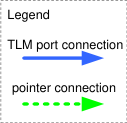
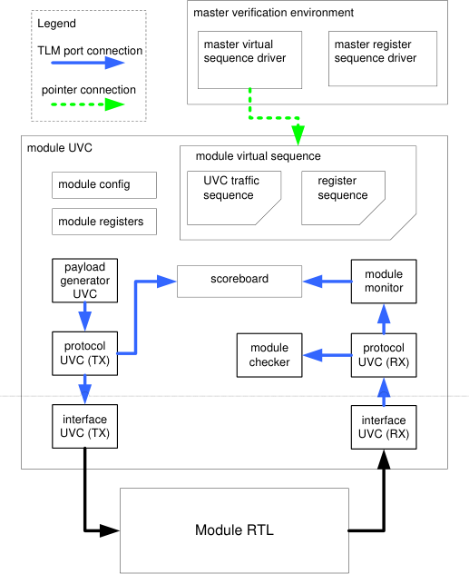
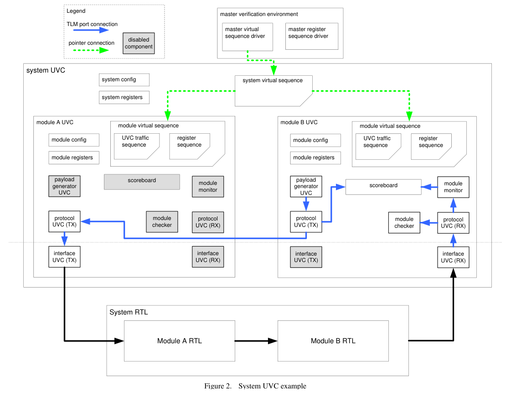
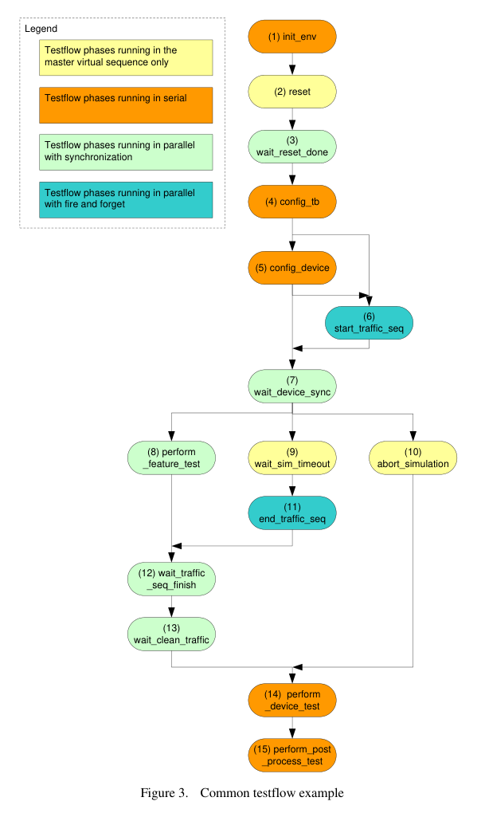

# **Maximize Vertical Reuse, Building Module to System** **Verification Environments with UVM e**


Deepali Joshi

PMC-Sierra
8555 Baxter Place,

Burnaby, BC
Canada, V5A 4V7

604-415-6000


Corey Goss,

Cadence,
1130 Morrison Dr,

Kanata, ON
Canada, K2H 9N6

613-828-5626


Horace Chan

PMC-Sierra
8555 Baxter Place,

Burnaby, BC
Canada, V5A 4V7

604-415-6000


Brian Vandegriend

PMC-Sierra
8555 Baxter Place,

Burnaby, BC
Canada, V5A 4V7

604-415-6000


_**Abstract**_ **—Given the size and complexity of modern ASICs/SoC,**
**coupled with their tight project schedule, it is impractical to**
**build a complete system or chip level verification environment**
**from scratch. Instead, in order to increase productivity,**
**maximizing reuse of existing verification components seamlessly**
**with the project has become one of the biggest opportunities to**
**increase verification efficiency. In this paper, we present a**
**testbench framework to maximize vertical reuse within a project.**
**The framework presented here has been proven on the**
**ground-up development of a 200M gates ASIC. In our**
**framework, the system testbench is built in a hierarchical**
**manner by recursively importing lower level block or module**
**testbenches. From the lowest level to the highest level, all the**
**testbenches are designed to support plug-and-play integration.**
**Verification engineers can hook up several lower level**
**testbenches and turn them into a higher level testbench. The**
**system testbench inherits the device configuration sequences,**
**traffic generation sequences, checkers and monitors from the**
**imported module testbenches without duplication of effort. As**
**a result, vertical reuse shortens the development time of the**
**system testbench, improves the quality of testbench code and**
**allows fast bring up during system integration.**


_**Keywords: Veritical Reuse, UVM, Specman, Module UVC,**_
_**System UVC**_


I. INTRODUCTION

Building system or chip level testbenches from the
ground-up is a feasible undertaking for devices up to several
million gates. However, past devices of this size (1-10M
gates) now form subsystems of today’s devices with 100
million gates or more. Thus a new approach is required to
achieve the productivity gains required in order to avoid
applying the same scale factor (10x) to the number of
verification engineers. Tackling devices of this magnitude
(100M+ gates) must involve using the divide and conquer
strategy, divide the device into smaller subsystems, and then
further divide the subsystems into even smaller modules or
blocks to limit the scope of verification at each level. A
module testbench is built to thoroughly verify each and every
module feature. A subsystem testbench is built to verify
subsystem level features and the interaction among the
modules within the subsystem. Finally, a system testbench is
built to verify the interactions between the subsystems. Due
to schedule pressures, resources and budget limitations, it is
not feasible to build every testbench from scratch. Therefore,
it is always desirable to share and reuse code from one
testbench to another in order to minimize the development


effort and improve the quality of the testbench by using proven
code instead of duplicating some of the effort by developing
new code.


With the introduction of UVM the industry has
standardized on a common testbench architecture, which
enables easy reuse of in-house or 3 [rd] party verification IP (VIP)
and individual testbench components such as data generators
and receivers, traffic and configuration sequences, protocol
checkers and coverage models, scoreboards, etc. In the
previous project, we had hoped the UVM architecture would
have helped us facilitate module to system level reuse.
However, we found that the current UVM guidelines lacked
the framework to support seamless plug-and-play integration
from module testbenches to the system testbench. In the
previous project, verification engineers attempted to reuse
components, such as sequences, checkers and monitors from
model and testbenches in the system testbench directly. In
the end though, this approach failed for the following reasons:
(1) Code Maintenance: the code in module testbenches is
designed for module level testing and tends to evolve over
time with little consideration for impact in the system level
testbench. As a result, system verification engineers wasted
significant amount of time trying to integrate new releases of
the lower level testbenches. (2) Debug was a challenge: the
module and subsystem RTL often went through many changes
during the project and gradually matured. The
module/subsystem level verification engineers addressed those
changes in their testbenches but sometimes failed to
communicate the necessary changes to the system verification
engineers. As a result, the system verification engineers
wasted a lot of time debugging failed testcases that turned out
to be non-issues. (3) Knowledge Transfer: When system
verification engineers debugged a failed testcase it was
difficult to get quick support from subsystem verification
engineers since they were not familiar with the system
testbench and they could not easily reproduce the failed
scenario in subsystem testbench. Thus, because of these
reasons, the re-use model broke down and the verification
engineers tended to duplicate code from the lower level
testbench or merely used it as reference for a slightly different
implementation at system level.


The current device, on which this paper is based, is four
times bigger than the previous project, with significantly more
ground-up development. Therefore, we had to streamline our
vertical reuse strategy to minimize the time and effort spent by
addressing the problems we had encountered in the past. Our
goal is to create a testbench framework that maximizes vertical


reuse, thus achieving significant productivity gains. The
system level testbench can import subsystem level and module
level testbenches directly and reuse all their individual
components. Changes in lower level testbenches propagate
automatically to the system level testbench. The system
testbench can export its configuration to lower level
testbenches which allows the lower level verification engineers
to recreate and debug failed test scenarios. The testbench
framework supports plug-and-play integration, so the system
verification engineers can focus on testing system level issues
without being overloaded by mundane operation details of the
lower level testbenches.


We surveyed existing papers and articles on vertical reuse
to see what we can learn from other experiences. In [1],
Froechlich proposed a reusing scheme that supports turning an
active agent into a passive agent and synchronizing traffic
generators based on _**e**_ RM _._ In [2], the author proposed a
module-to-system reuse topology based on scoreboard
chaining with internal monitors to provide extra debug support.
In [3], the author of the article brought up some concerns
regarding module to system reuse suggesting that the features
in the module level environment is a superset of the features in
the system level environment. Thus the system testbench has
to select wisely what to import from lower level testbenches.
In [4], D’Onofrio outlined a reusable verification environment
using multiple layers of highly configurable components with
OVM. This scheme is very similar to the system UVC
architecture upon which we based our testbench framework.
The above four papers gave us a good theoretical
understanding of vertical reuse, but all of them lack practical
applications and implementation examples. [5] and [6] fill in
the missing information by summarizing the lessons learned
from successful vertical reuse projects. Both papers stressed
the importance of using the testflow concept to co-ordinate the
test execution among the lower level testbenches, which is also
one of the key components in our vertical reuse testbench
framework.


Our goal is simply to design a solution to maximize
vertical reuse within a project. We applied the lessons
learned from previous project and addressed the questions
raised in the previous paragraphs to design our new testbench
framework, which is implemented based on the latest version
of the UVM _**e**_ verification methodology. During the
development of our vertical reuse framework, we discovered
some limitations and scalability issues of the existing UVM
framework. In order to overcome those limitations, we came
up with three enhancements to the existing UVM framework
to allow seamless integration of module testbenches into the
system testbench.


The paper is organized as follows: In section 2, we
introduce the existing UVM framework for module to system
reuse. In section 3, we present our enhancements to the
UVM framework in details. In section 4, we will summarize
the benefits of vertical reuse and provide some benchmarking
results and outcome from our project. In section 5, we
outline the challenges of vertical reuse that we encountered
during the project and recommend improvements from lessons
learned. In the last section, we will briefly investigate the
feasibility of porting our vertical reuse framework from UVM
_**e**_ to UVM SystemVerilog


II. SYSTEM UVC ARCHITECTURE

Our testbench framework is based on the UVM _**e**_ System
UVC architecture outlined in the UVM _**e**_ User Guide [7].
The System UVC architecture is a solid foundation for vertical
reuse, in that it outlines vertical reuse topology and discusses
how to configure lower level UVCs that are promoted into
higher level UVCs. It also has useful guidelines on how to
implement and maintain the reuse code in the lower level
UVC. This section will briefly introduce the concept of
vertical reuse. Please refer to [7] for implementation details.


Figure 1 shows a module testbench. The terms “module
testbench” and “system testbench” are relative. A module
UVC is a lower level UVC to a system level UVC, which itself
may also be a module UVC relative to a higher level system
UVC. The device level or system testbench can be built
hierarchically by importing one or more layers of module
UVCs. The module testbench is very similar to a typical
UVM testbench with the following exceptions: (1) The master
virtual sequence driver and register sequence driver exist
outside of the module UVC, since in each verification
environment, there is always one and only one master
sequence to control the test flow. The master virtual
sequence driver and register sequence driver are linked to the
test flow virtual sequence inside the module UVC using
pointers. (2) The stimulus generation is separated into multiple
layers: the interface layer directly drives the RTL signals, the
protocol layers deal with transaction level processing, and the
payload generation layer create the client payload. Each
layer is connected by TLM ports, so the system UVC can tap
into any layer in the protocol stack without changing the
structure of the imported module UVC. (3) The receiving
traffic checker and monitor are also structured in a similar
manner using TLM ports. In addition to reused protocol
checkers VIP UVCs, the module UVC has its own checkers
and scoreboard that are accessible by the system UVC.


Figure 2 shows a system UVC that imports two module







Figure 1. Module UVC example


UVCs as a simplified example. There is no limitation to the
numbers of module UVCs in a system UVC and the depth of
module UVC levels in the actual implementation. Our
system testbench UVC is composed of 10 subsystem UVCs
and some subsystem UVCs have 3-4 module UVCs, thus have
a total depth of 3. In the system testbench, the master virtual
sequence driver is linked to the virtual sequence of the system
UVC, which in turn links to the virtual sequence of the
imported module UVCs. The module UVC signal port
interfaces that are connected to internal RTL signals are
disabled by system UVC. If the traffic generation in a
module UVC depends on another module UVC, such as one
protocol being encapsulated in another protocol, the system
UVC will connect the TLM ports of associated protocol layers
in the related module UVCs. The module monitors and
scoreboard are chained up to perform end-to-end checking.
For interface UVCs found in the middle of the DUT, they are
often disabled, but can be enabled as passive agents. This
allows the module level checkers and scoreboard to perform
hop-by-hop checking, which helps the verification engineer to
pin point the failure when debugging a failed system testcase.


III. ENHANCEMENTS TO SYSTEM UVC ARCHITECTURE

Although the system UVM architecture is designed to
address many concerts in vertical reuse, we found its structure
is not flexible and sometimes inconvenient to implement.
Therefore we proposed three enhancements to system UVC


architecture to address the problems.


_A._ _TLM port router_

The system UVM architecture relies on the TLM port
binding mechanism to transport sequence items and
transaction records among module UVCs. However there are
some limitations in the UVM TLM port default binding
mechanism such as: (1) the TLM transport port only supports
one-to-one binding, (2) the TLM analysis port supports
one-to-many binding, but the transaction record is always
broadcast to all the input TLM ports, and (3) once the input
and output TLM ports are bound, the binding is static. The
limitations impose a rigid restriction in how the system UVC
imports and connects to lower level module UVCs. In order
to support flexible module UVC configuration during
simulation, we developed a TLM port router to overcome the
above limitations. The system UVC connects the module
UVC TLM ports to the TLM port routers instead of connecting
up the ports directly. With the help of the TLM port router,
the system UVC can easily change the routing table to redirect
or reconfigure the port connection during the simulation.


The TLM port router is implemented using an _**e**_ template
which allows reuse of the same piece of code on various data
types. The router implements a table based generic routing
algorithm using the port id and channel id. The port id is
determined by which TLM port interface the transaction comes
in. The channel is fetched from within the transaction using a





built in extended method. The source port id and channel id
pair is used as the key to look up the destination port id and
channel id from the routing table. There could be more than
one destination for each source if the transaction supports
multicasting. The router will update the transaction with the
new channel id, duplicate the transaction in the case of
multicasting and then send them out to the corresponding
destination port(s). The routing table look up algorithm is
implemented using an _**e**_ keyed list to speed up the search time.
The following is an example of the header definition of a TLM
analysis port router and the routing table.

```
template unit port_router_u of (<type>) {
in_ports : list of in interface_port of
tlm_analysis of <type> is instance;
out_ports : list of out interface_port of
tlm_analysis of <type> is instance;

get_channel_id(tr : <type>) : uint is {};
set_channel_id(tr : <type>, cid : uint) is {}

routing_table : list of src_route_table_entry_s;
};

struct dest_route_table_entry_s {
enable   : bool;
port_id  : uint;
channel_id : uint;
};

struct src_route_table_entry_s {
enable    : bool;
port_id   : uint;
channel_id  : uint;
destinations : list of dest_route_table_entry_s;
};

```

_B._ _Common UVC Configuration Control_

When the module UVC is used at the module level
testbench environment, the TLM ports between all the internal
UVCs, monitors and scoreboards are connected and bound.
However, once the TLM ports in the module UVC are bound,
the system UVC cannot unbind the TLM ports without
affecting the expected functionality of the module UVC. One
way to solve this problem is to leave out the binding
constraints from the reuse portion of the module UVC
altogether. The system UVC has to reference the code in the
module testbench to connect the internal components of the
module UVC from scratch. This solution is not productive
since the system verification engineer often lacks the
understanding in the internal connections of the module UVC.
Since the system UVC often preserves most of the connections
inside the module UVC, a better solution is to let the system
UVCs disconnect the binding of unwanted connections, while
keeping the rest intact.


Each module UVC has a common configuration control
table. It stores all the binding options for each UVC and
components inside the module UVC. The table is organized
using the RTL port as the first index and the number of
protocol stack layers at the port as the second index. The
table keeps track of whether the UVC is enabled or disabled,
whether the agent is active or passive, and whether the TLM
port binding is connected or left open. The module UVC has
to obey the configuration control when generating the UVC
instances or hooking up the TLM ports in the connect ports


phase. The table is implemented using a keyed list to provide
quick access to the configuration control information. The
following is an example of the common configuration control
table.

```
struct config_ctrl_s {
layer_name  : layer_t;
enable    : bool;
is_active  : uvm_active_passive_t;
bind_enable : bool;
};

struct port_config_ctrl_s {
port_name  : port_t;
layer_config : list of config_ctrl_s;
};

extend uvm_env {
config_ctrl_table : list of port_config_ctrl_s;

get_uvc_enable(port:port_t, layer:layer_t)
: bool is {};
get_uvc_is_active(port:port_t, layer:layer_t)
: uvm_active_passive_t is {};
get_uvc_bind_enable(port:port_t, layer:layer_t)
: uvm_active_passive_t is {};

// usage examples
keep vip_env.agent.is_active ==
get_uvc_is_active(PORT_AXI, LAYER_ENET);

connect_pointer() is also {
if (get_uvc_bind_enable(PORT_AXI, LAYER_ENET) {
vip_env.agent.tlm_out_port.connect(
vip2_env.agent.tlm_in_port;
);
};
};
};

```

_C._ _Common Test Flow Virtual Sequence_

The virtual sequence of each module UVC runs the
configuration sequences and traffic generation sequences of
the module UVC. The system UVC needs a mechanism to
co-ordinate and synchronizes the behavior of the imported
module UVCs. In our vertical reuse framework, all module
UVC virtual sequences inherit a common testflow structure,
which defines empty time consuming methods (TCM) known
as testflow phases. Each testflow phase is designated to carry
out a specific function in the simulation. The module level
verification engineer extends the testflow phases and fills in
the required actions for module level testing. We decided not
to use the UVM _**e**_ testflow because it is too complicated,
requires too much setup and prone to human error. We
implemented a simpler testflow with a single entry point at the
highest level testbench. The system UVC virtual sequence
will execute all the testflow phases from all imported module
UVC in lock step. We defined three different kinds of
testflow phases which represent three different ways to
synchronize the module UVCs and system UVC: (1)
Execution in serial, in which the testflow phase of one module
UVC is executed to completion before moving to the same
testflow phase in another module UVC. For example, using
this test phase type will ensure two module UVCs would not
interleave their register accesses. (2) Execution in parallel, in
which the same testflow phases of all the module UVC are
launched in parallel and the system UVC testflow phase will


not move forward to the next testflow phase until all the
module UVC testflow phases are completed. For example,
the testflow cannot proceed until all modules come out from
reset. (3) Execution in parallel with fire and forget, in which
the same testflow phases of all the module UVC are launched
in parallel, but the system UVC testflow phase moves on to the
next testlflow phase once all the testflow phases in the module
UVCs are launched. For example, all modules start their
traffic sequences with no need of co-ordination among the
sequences.


System verification engineer can use the three basic
testflow phase kinds to build up a common testflow that fits
the operation of the device with lots of flexibility. Figure 3
shows an example of the testflow phases used in our project:


_1)_ initialize the testbench environment.
_2)_ toggle the reset pin of the device
_3)_ wait until device ready is ready for accepting register

access
_4)_ configure the testbench with procedure code
_5)_ configure the device with register or backdoor access
_6)_ start traffic generation


_7)_ wait for the device to stablize
_8)_ empty method hook for testcases to create stimulus
_9)_ end simulation gracefully if timeout period expires
_10)_ catch system errors and abort the simulation
_11)_ inititiate the termination of the traffic sequences
_12)_ wait for all the traffic sequences to be terminated
_13)_ wait for the clean traffic to flush out the device pipeline
_14)_ check the device status
_15)_ execute time consuming post simulation checks


IV. BENEFITS AND RESULTS

The most significant benefit of vertical reuse in verification
is the engineering time saved. In general, the development
effort and the number of bugs in the testbench is proportional
to the number of lines of code in the testbench. The bigger
the testbench, the more time spent in writing the testbench and
catching testbench bugs instead of catching RTL bugs. In
table 1, we compare the size of the testbench in the current
project against the previous project, which gave us a good
approximation of the productivity gain. With the help of our
vertical reuse framework, we were able to verify more gates
with fewer lines of code. If we measure the code density,
how many gates are verified by one line of code, we achieved
a very impressive four times productivity increase in the
current project.


TABLE I. VERITICAL REUSE STATISITC





|Statistic measure|Previous<br>Project|Current<br>project|Changes|
|---|---|---|---|
|Gates count|60M|200M|+333%|
|Total lines of code|575k|484k|-16%|
|System testbench lines of code|324k|215k|-34%|
|% system testbench in total code|56%|44%|-22%|
|Gates verified per line of code|104k|413k|+400%|


The vertical reuse framework also saved us significant time
in system integration, thus enabling us along with other
methods [8] to meet a tight tape-out schedule. In the previous
project, it took 2-3 months to build the system level testbench.
In addition, endless hours were spent in maintaining the
system testbench code to keep up with all the wanted and
unwanted changes in new module level testbench releases.
In this project, since the module level testbench is designed to
support plug-and-play integration, on average it takes 2-3 days
to get one subsystem up and running. The complete system
level testbench was fully integrated in less than a month. The
verification engineer is able to easily populate the new code
from the module testbench, and in most cases it will work in
the system-level testbench unchanged. In the previous
project, system level verification engineers struggled greatly to
understand how to stitch all the pieces of reuse code from
lower level testbenches together. In this project, it is much
easier to develop system level testcase. Verification engineers
can simply import two subsystem level testcases, constrain
them to generate coherent traffic mode and finish a system
level testcase in less than 20 lines of code.


Another benefit of our vertical reuse framework is the
speeding up of system level debug turnaround time. In the
previous project, when a system verification engineer
encountered a system level bug, it was hard to pull in
subsystem verification engineers to debug the problem, since
the subsystem verification engineers are not familiar with the
system level testbench. In this project, when we found a bug,
we can enable the internal monitors of the module UVCs in
passive mode and it provides us the same detail debug
information as in the module level testbench. The subsystem
verification engineers do not need any ramp up time to help us
analyze the problem because they are essentially working with
their own testbench.


V. CHALLENGES

We have learned some lessons about vertical reuse from
this project. The first challenge is revision control of the
reuse VIPs used across multiple module testbenches.
Usually, more than one module UVC reuses the same VIP. If
the two module UVCs require different revisions of the same
VIP, there will be a revision conflict at the system UVC level.
We addressed this problem in several ways: (1) freeze the
development of the reuse VIP early in the project, (2) if
changes to VIP are unavoidable, the new revision should be
backward compatible with older revisions and (3) if backward
compatibility cannot be maintained, the verification engineer
who is in charge of system UVC integration should
co-ordinate with module level verification engineers to update
the reuse VIP revision used in all module UVCs at the same
time.


The second challenge was that poor quality code from the
module UVCs impaired the system level testbench
performance. Junior verification engineers working in the
module UVC sometimes implement inefficient code that
consumes a lot of CPU cycles or causes memory leaks. In
module level testing, the simulation footprint is small and the
simulation time is short, hence the problem of bad code never
surfaces. The system UVC inherits all the code of the
module UVCs, including the bad code. In system level
environment, there are multiple instances of the module UVC
and the simulation runs for a much longer time. The bad
code quickly degrades simulation performance and can
sometimes even causes the simulation to crash. As a
guideline, the module UVC verification engineer should run
profiling on their code to identify and fix any bad code.
Experienced verification engineers should conduct a code
review with junior verification engineers to catch any potential
problems early in the development cycle. For example, we
had a 30% simulation performance improvement just by
rewriting a dozen lines of bad code.


VI. FUTURE DEVELOPMENT

The vertical reuse framework outlined in this paper is
implemented using UVM _**e**_ _._ Since UVM SystemVerilog (SV)
is also the other popular verification methodology in the
industry, we conducted a brief feasibility study to investigate
the possibility of porting the vertical reuse framework to SV.
One of the major obstacles is that SV does not support Aspect
Oriented Program (AOP), and many of the module-to-system
UVC features are implemented using AOP techniques.


According to [9], SV can mimic AOP techniques using design
patterns, but code implemented using design patterns require
considerably more lines code to implement using more
complicate software structures than the code implemented
using native AOP language constructs.


System UVCs that imports and instantiates module UVMs
is an application of typical OOP programming technique,
supported by both _**e**_ and SV. However in the UVM _**e**_ _s_ ystem
UVC architecture, system UVCs use when-subtypes to
override default settings in module UVCs. It is possible to
implement the settings control using SV by explicitly
exporting the configuration parameters of the module UVC.
However, for reasons mentioned above, using design patterns
is less convenient as it requires more up front planning. It
also requires accesses to module UVC source code just in case
the system verification engineer has to modify the module
UVC classes.


Both the TLM port router and common configuration
control implement the look up table using _**e**_ keyed list, which
is similar to associative array in SV. The TLM port router
uses template to reuse the same piece of code on different data
types, which is similar to parameterized types in SV module.
The biggest problem porting the framework to SV is the
common testflow phases that used many AOP techniques. It
would require a lot of work to replace the current AOP
implementation of the testflow phases using callback functions
and class factories. It may not be practical, but it is possible,
at least in theory.


VII. CONCLUSION

In this paper, the authors successfully implemented a
module to system vertical reuse strategy to verify a 200 million
gate device. There are many advantages of vertical reuse
including higher productivity, fewer bugs and higher quality in
the testbench code, and faster RTL debug turnaround time.
All benefits contribute to both lowering the development cost
and shortening the project schedule. There is a 4x
productivity improvement when measuring productivity using
code density.


REFERENCES

[1] H. Froehlich, “Increased verification productivity through extensive

reuse”, Design Reuse, [http://www.design-reuse.com](http://www.design-reuse.com/)
/articles/7355/increased-verification-productivity-through-extensive-reu
se.html

[2] Think Verification, “Plug, play and reuse”, http://
[www.thinkverification.com/tips/55.html](http://www.thinkverification.com/)

[3] T.P. Ng, “Reusable verification environment for core based Designs”,

http://www.design-reuse.com/articles/9924/reusable-verification-enviro
nment-for-core-based-designs.html

[4] S. D’Onofrio, “Building reusable verification environments with


[OVM”, Tech Design Forums, http://www.techdesignforums. com](http://www.techdesignforums.com/)
/eda/technique/building-reusable-verification-environments-with-ovm/

[5] J.H. Zhang,. “Achieving vertical reuse in SoC verification”, CDNLive

2005

[6] M. Strickland, “Simplifying vertical reuse with specman elite”,

CDNLive 2007

[7] Cadence, “UVM e user guide, Cadence doc”, 2012

[8] H. Chan, “Can you even debug a 200M+ gate design?”, DVCON2013

[9] M. Vax, “Where OOP falls short of hardware verification needs”,

DVCON201


