# **IDEs SHOULD BE AVAILABLE TO** **HARDWARE ENGINEERS TOO!**

Syed Daniyal Khurram Horace Chan
Microsemi                                                   Microsemi
8555 Baxter Place,                                            8555 Baxter Place,
Burnaby, BC                                                 Burnaby, BC
Canada, V5A 4V7                                             Canada, V5A 4V7
604-415-6000                                                604-415-6000

_**Abstract**_ **-** **Modern integrated development environments (IDEs) represent a new era of tools for code development and**
**debug, and are pushing out legacy software development environments in Vim and Emacs. However, why limit using**
**these tools exclusively in the software world? When in fact the benefits of using a GUI based development environment**
**for HDL programming has a direct impact on the hardware development and verification effort required. This paper**
**illustrates the advantages of using SystemVerilog IDEs which, when properly employed, can help decrease debug and**
**turnaround times related to code compilation and simulation, improve code readability, comprehension and**
**maintainability, and boost productivity.**

I. INTRODUCTION
In this paper, we will evaluate several different System Verilog (SV) integrated development environments to
evaluate their advantages and shortcomings and how they can improve the productivity of hardware verification
engineers. Modern ASIC design complexities include million or even billions of gates and comprise several
hundreds and thousands of lines of RTL code. Verifying the correctness of these designs requires the development
of large and complex testbench (TB) environments [1], which in the past was done using conventional text editors
such as Vim and Emacs. The popularity and support-base of IDEs in the software community is now creating a
push towards the adoption of IDEs in the hardware verification community as well, with modern hardware
verification reaching new levels of abstraction and becoming increasingly software oriented.

This paper will outline the features of four major SystemVerilog IDEs based on an internal company analysis in
using each IDE for the verification of a 300 million+ gate chip. Specifically, the paper will focus on two key areas:
full feature comparison of each IDE in keeping with the demand of a modern SystemVerilog Universal Verification
Methodology (UVM) TB and; IDE integration with Version Control Systems (VCS). Additionally, the paper will
examine the usability aspect of these tools and address inherent misconceptions towards the adoption of these tools
in the hardware development community. Despite a focus on hardware verification, extension of features for
hardware design will also be explored.

II. SYSTEMVERILOG IDE FEATURE OVERVIEW
The three major commercial SystemVerilog IDEs of concern are SlickEdit, Sigasi, and Design and Verification
Tools (DVT) Eclipse IDE. SystemVerilog Editor (SVeditor), a fourth non-commercial (license-free) IDE has also
been included as part of the study as a point of reference. An example of usage of each core feature has been
included in the form of diagrams for visual depiction, using the UBUS code example bundle pre-included with the
UVM 1.2 standard class library [2].

_A. IDE Features_

Each IDE provides support for some common features, based on their popularity and use in software engineering
development flows. This section highlights the benefit these features offer as an alternative to traditional text editors
such as Vim and Emacs. While the extent and power of IDEs is best utilized for TB verification, hardware design
oriented features have also been mentioned to provide a comprehensive analysis:

   - Syntax highlighting: A source code editor provides color syntax highlighting. Various colors indicate

different syntactic categories of text according to the syntax definition in use.

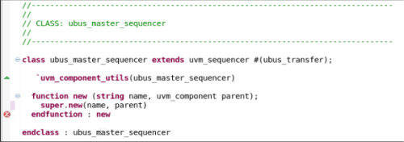

Figure 1. Syntax Highlighting (SVEditor)

In most cases, the source editor is also syntax aware, highlighting errors as you type them instead of relying
on finding mistakes during compile time. For example: the call to the super-class’s new () method is
missing a semi-colon representing an end of line delimiter (“Fig. 1”). The editor detects this mistake and
notifies by placing a red error bubble in a side-column in the following line.
Although the same features are available in text editors such as Vim and Emacs, what differentiates IDEs is
that these features are available pre-packaged within the environment and do not require the installation of
external plug-ins.

- Symbol Navigation: Symbol navigation allows for ease in code and structural navigation. Each IDE

supports two options for symbol lookup. A search by ‘Definition’ is used to jump from a symbol to its
definition and view any associated documentation. Similarly, a search by ‘Reference’ is used to list all
occurrences of a symbol and optionally navigate to one or more references or ‘call’ to the symbol.

Example: A search by definition of the class object ‘monitor’ done by highlighting the class name inside
the ‘ubus_master_agent’ class highlights the declaration of that object in the same window (“Fig. 2”). A
search by definition of the class itself will open up the class definition in turn. When opening a
declaration to an object from another file, the tool will jump to the file containing the declaration of that
object in the project hierarchy.
Similarly, a search by reference (“Fig. 3”) of the class ‘ubus_master_monitor’ lists all the associations to
the string in the project hierarchy in a separate window, including a tag for the ‘ubus_master_monitor’
class located within the ‘ubus_master_agent’ as seen in “Fig. 2”.

Figure 3. Search by reference (DVT)

Figure 2. Search by declaration (DVT)

These two features have proven to be very useful in navigating the TB structure during code reviews and
audits. Syntax validation and Symbol navigation have also saved valuable debug and compilation time on
numerous occasions throughout project workflows.
Traditional editors relied on either external or less powerful built in search plugins to facilitate symbol
navigation. Experience has shown that using these facilities can become quite cumbersome and time

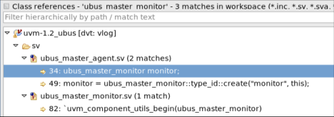

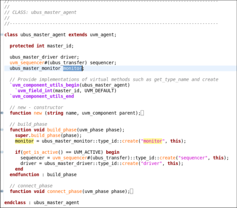
consuming when dealing with symbol definitions that are spread out across different directories. Using
search utilities such as ‘grep’ for symbol lookup also requires specifying the path name relative to the current
working directory. This is an added step, compared to an IDE which accomplishes the same functionality
with one simple mouse-click and no knowledge of the project hierarchy .Considering the vast majority of an
HDL programmers time is spent on analyzing code as opposed to writing it [3], IDEs save time and resources
by removing the need for symbol navigation tool plug-ins and the need to specify a file/directory location for
symbol lookup.

- Search and Replace algorithms: An interactive semantic search window supports advanced ‘Find’ and

‘Replace’ features spanning one or more files, as well as the use of powerful regular expressions
allowing users to find relevant information across tens of thousands of lines of code and the entire project
tree hierarchy. Each of the tools evaluated support UNIX style regular expressions, alongside SlickEdit,
which also supports regular expressions in Perl, Brief, Wildcards and a custom SlickEdit style syntax.
This provides just as much if not more capability as using external utilities such as ‘grep/’sed’ or inherent
search and replace functionality in Vim and Emac editors.
No longer does one have to shift to the command line to do a search through the directory tree of a
project to find files containing the desired string. “Fig. 4” presents an example of using the Search
option in SVEditor to lookup the regex expression “ubus_master*”. In accordance with regular
expression theory, the in-built search engine returns any string that contains at least the word
“ubus_master”, as well as the file and the exact line that contains it. The results are displayed on the top
right corner of the screen, and clicking any one of the results will open the file that contains it and
highlight the string. Some editors will display the occurrence of the string in a separate window whilst
retaining the original file or section of text being worked on.

Figure 4. Search and Replace (SVEditor)

The replace functionality can be utilized both to replace a symbol locally and to replace all references to the
symbol in the workspace.

In addition to conventional replace functionality, some IDEs also support context aware rename refactoring
otherwise known as intelligent refactoring. Intelligent rename refactoring changes all relevant occurrences
of the renamed element but not necessarily all of them, by first compiling the code and resolving the
identifier and its references. Suppose a user wishes to refactor a recently renamed register called
“UVM_TEST_REG” which just so happens to contain a register field also titled “UVM_TEST_REG”.
Renaming “UVM_TEST_REG” to “UVM_REG” in this scenario would change the actual register name to
the desired string and not the register field name. Although this is a very simple example, context aware
renaming can come especially in handy when dealing with design related changes e.g. renaming a port
declaration in SystemVerilog module A, but skipping over a separate module B which also has an internal
port with the same name as the port being refactored in module A. If module B, does not having anything

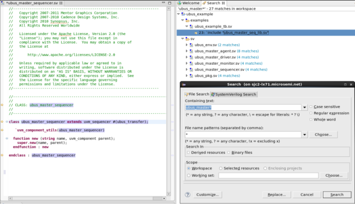
to do with module A, a normal search and replace would have replaced all occurrences of the port name
and led to a potential design bug.

Example: The string “ubus_master_monitor” is being renamed to “ubus_master_mon” throughout the
project hierarchy, as shown in “Fig. 5” This includes changing the “ubus_master_monitor” declaration in
the “ubus_master_agent” class but not in the comment above it: “Instantiating ubus_master_monitor here”.
This is because the refactoring engine is context aware and intelligently ignores the comment.

Figure 5. Context aware refactoring (DVT)

- File browsing: An interactive project explorer presents a hierarchical view of directories and files that have

been mounted for use in the IDE. “Fig. 6” presents a project view of all UVM files that are part of the
sv/ folder in our ubus example project. This feature provides a visual depiction of the TB structure and
organization and gives a user full control over its files/folders: allowing one to add, delete, rename and
organize them without having to rely on the command line to do so.

- Class browsing: An interactive explorer presents a hierarchical view of object oriented programming code.

The class ‘ubus_master_sequencer’ in “Fig. 7” below is a child of parent class ‘uvm_sequencer’, which
in itself has a hierarchical tree of uvm classes that it inherits from. This relationship is shown in the form
of a class hierarchy in the top left window, as well as any recursive items contained in the object itself
are listed, in the bottom left window, which includes all methods and variables in the class.

Figure 7. Class browsing (SVEditor)

Figure 6. File browsing (SVEditor)

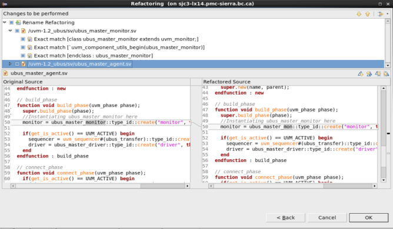

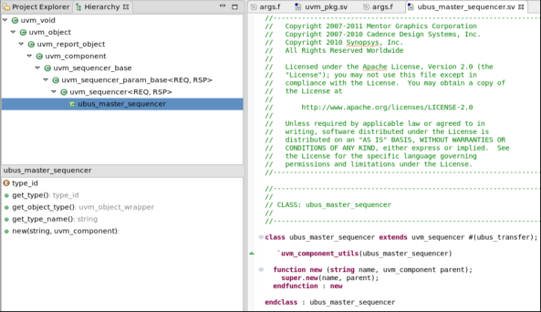

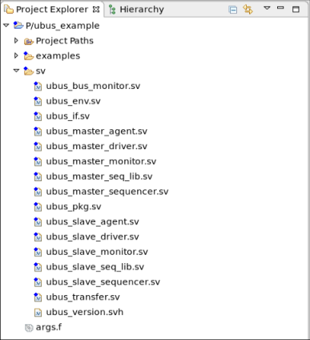
Using both these features removes effort that would normally be required to open up multiple files across
different tabs/terminals in order to understand the design organization and dependencies.

- Design hierarchy: The design hierarchy view has the ability to display recursively all instances of a

Verilog/SystemVerilog module, SystemVerilog interfaces as well as instances of a VHDL entity and
VHDL components. This feature has limited, if any support, in most IDEs, and is almost never utilized
for verification purposes. Design engineers may benefit from this behavior when trying to understand
the functionality of external IP or during design audits.

Example: The design hierarchy displays the “dut_dummy” module and “ubus_if” interface, both of
which are instantiated by the “ubus_tb_top” module.

Figure 8. Design hierarchy (SVEditor)

- Macro recording/Keyboard macros: Macros are bundles of code that allow you to automate repetitive

actions. Eclipse based IDEs support Macro programming through the installation of languageindependent Macro plug-ins whereas other commercial non-Eclipse based IDEs may include custom
programming languages upon which Macros are defined. These custom programming languages can be
quite verbose and powerful in nature. The SlickEdit IDE includes a proprietary scripting knowledge
known as Slick-C geared towards Macro programming. In fact, many of the actions performed using
SlickEdit are performed using Slick-C Macros such as menu/button interactions. The tool lets you create
a custom Macro simply by recording a series of user interactions and saving it as Slick-C source code

[4]. The Macro can re-opened anytime afterwards and modified through a user interface.
_Note_ : This paper only explores the use of Slick_C for tool evaluation purposes, and does not utilize the
full extent and power of the language.

Example : The defined macro lets us create a function called “display_macro()” which has a single
display statement that prints out the following string “This MACRO has been created”. The macro is
then recorded and converted to Slick-C source code and saved in the vusrmacs.e file in the user
configuration directory . When re-executed the command runs successfully and creates the intended
function. The Macro can also be bound to a shortcut key if desired and edited whenever required.

Figure 9. Macro recording (SlickEdit)

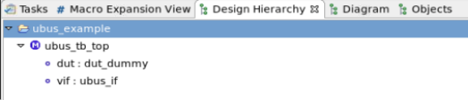

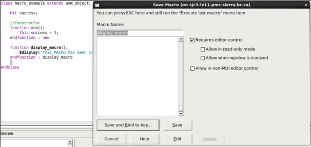
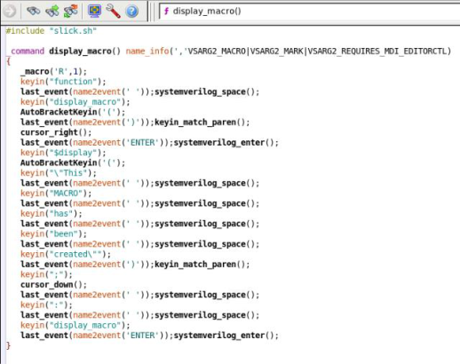

Figure 10. Macro conversion to Slick-C code (Slickedit)

Some common examples of Macro usage include: 1) Macros creation to find out if a particular line of
code has been selected or 2) for recording a search algorithm used for finding a commonly occurring
string inside a file dump that is updated after each simulation run.
Keyboard macros in IDEs although powerful take a step back when compared to Macro programming in
Emacs. Macro programming in Emacs can be much faster when in the hands of an experienced user and
can be used to simplify remarkably complex pieces of code when used in conjunctions with the Elisp
scripting language.

- Macro expansion: Some simulators will define proprietary pre-processing code that might have some

implications on the actual simulated code. These macros can be opened in a separate interactive window
and traced through using Macro expansion and debug features available, such as line-by-line code runthrough and highlighting, as well as breakpoint insertion for debug. The same features can be used to
analyze macros defined in mixed-language source code files, custom macros created in a tool specific
programming language, as well as macros included as part of a verification methodology standard
package such as UVM.

Example: “Fig. 11” depicts the internal code definition of the uvm_component_utils macro, expanded
one level deep.

Figure 11. Macro expansion for uvm_component factory (SVEditor)

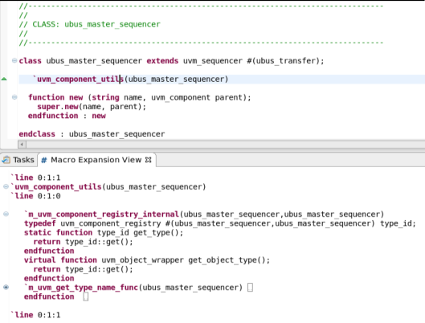
UVM has a large number of Macros useful for specifying user intent without writing a large number of
SystemVerilog constructs. Macro expansion can be used to analyze the exact structure and intent of these
Macros with a few clicks and minimal effort.

- Auto editing: Intelligent formatting features provide advanced code editing features such as auto

completion, auto-parameterization (displaying parameters that are compatible with the current
highlighted parameter) and inline expansion.
Auto-completion in particular can save time and effort required to look up entities contained in an object,
especially if the object declaration is spread out across the project file space, as well as reduce humantyping error. The feature is used to list out all TB methods and entities and is not limited to language
specific keywords only. Auto editing effectively provides answers to common questions that arise
during code development: What is the name of the method that you wish to use? What are a methods
order of arguments? What are the possible values of an enumerated type?

Example: Pressing ‘.’ followed by ALT+Space inside a class object in SVeditor will display all available
methods/variable in a class; as shown in “Fig. 12”.

Figure 12. Auto completion (SVEditor)

All Eclipse based IDEs also contain smart indentation abilities. Any un-indented text is automatically
fixed when pasted in the GUI editor. Similarly as you type Eclipse will make a smart guess as to the
indentation required for the current line. Each IDE also has configurable preference settings for defining
the ‘tab-width’ and for replacing tabs with spaces.
Compared with legacy editors IDEs offer a noticeable improvement in preventing accidental difficulties.
Features such as auto-editing when used in conjuction with symbol navigation and syntax highlighting
removed any loss of productivity due to syntax errors [5].

- Code collapse: Code ‘folding’ or ‘collapsing’ is a feature that allows for selective hiding or displaying of

code. This comes in handy when analyzing extraordinarily long files, or for displaying only relevant
lines of code especially during code reviews. These tucked in pieces of code can then be
unfolded/folded, typically by pressing a graphical [-] or [+] gimmick located next to the first line of code
such as a function header or through a menu based option.

Example: The “ubus_master_sequencer” class constructor has been folded as shown in “Fig. 13”.
Pressing the blue “+” icon on the left of the function header will automatically roll out the entire

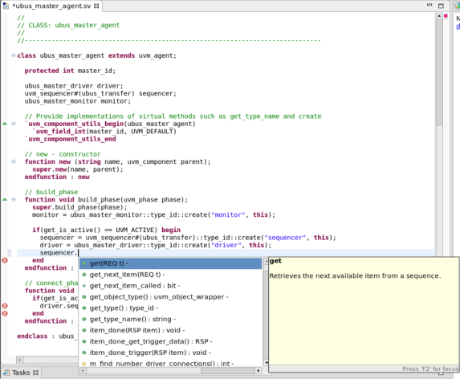
function. Similarly pressing the “-“button next to the class “ubus_master_sequencer” class header will
collapse the entire class.

Figure 13. Code collapse (SVEditor)

By expanding or collapsing certain sections of the code, a user has a better understanding of the inherent
complexity of the code and is able to reconstruct an intelligible mental picture of the design space.

   - Multi-language: Each commercial IDE supports source code development in Verilog/SystemVerilog and

VHDL. It should be noted that DVT and Sigasi require enhanced commercial licenses to support VHDL
and Verilog/SystemVerilog together:
DVT: A separate singular license is required per HDL. Using multiple licenses also offers the benefit of
mixed language capabilities.
Sigasi : Multiple and Mixed language capabilities offered in Sigasi Studio XL and Sigasi Studio XL Doc.
Dual-language editing capabilities are available in Sigasi Starter as well but at the expense of symbol
navigation across multiple files, which is only enabled for the language configured.

_B. Integration with tool and standards_

Many commercial IDEs offer additional features and integration with popular simulation tools and standards.

   - Verification methodology support: Each of the listed IDEs offer integration with the Universal Verification

Methodology (UVM) standard due to its significance in largescale modern ASIC verification [2].
Additional UVM specific debug capabilities are also provided by some commercial IDEs:

`o` UVM factory queries: UVM factory related constructs that influence the behavior of the TB can

be located by utilizing UVM factory queries to search for config db setters, config db getters
and factory overrides. This feature is currently only available in DVT.

`o` UVM template: Built-in templates for common constructs specific to verification methodologies

such as a UVM agent are provided, saving time otherwise spent in copying/creating the class
based UVM structure from scratch. This feature is currently only available in DVT.

`o` UVM browser: The UVM browser allows a user to visually explore all the classes of a UVM

based verification environment [6]. This feature is very useful in exploring the structure of a
TB during project hand-offs from the TB author to a new user and in TB inspection during code
reviews, thus reducing knowledge transfer time. This feature is currently only available in
DVT.

`o` UVM sequence tree: The UVM sequence call tree presents the hierarchy of a sequence ranging

from sub-sequences that are triggered by the sequence recursively down to implicit sequence
items. This has proven useful especially when debugging and understanding the flow of
sequences consisting of concurrently running fork/join processes. Currently this feature is only
available in DVT [7].
Similar UVM debug features are supported in most advanced simulators available in the market today
but can only be utilized post-compilation. UVM debug features inherent in an IDE can help save
valuable debug time and effort by detecting potential issues pre-compilation.

   - Integration with simulation tools: Using an add-on commercial tool plugin (DVTDebugger) for DVT

allows Integration with NCSim, Specman, VCS, and Questa simulators for on the fly simulation analysis
and debugging. A user can easily invoke a simulator from within the DVT GUI and then visualize its
output on the console through a smart log viewer. Errors and warnings dumped in the log file are

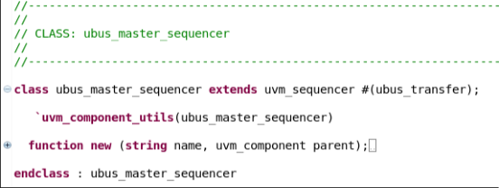
hyperlinked to the problematic source code [8]. Similarly, Sigasi can also be used to compile and launch
simulations from within the tool GUI and trace back any errors detected as soon as a file is saved/built by
launching an external compiler. This is currently supported only for Aldec Riviera-Pro,
ModelSim/QuestaSim, and Xilinx ISE/Vivado. Support for additional tools is available but limited to
only compilation support or limited simulation support in the form of elaboration checks [9].
Alternative ways of integration with external tools for Eclipse based IDEs can be done by 1) Creating an
external tools and build configuration(also available in SlickEdit Pro), 2) exporting the project in a
Makefile/CSV format in proper compilation order and using scripts to compile and simulate your design
based on the exported information .
_Note:_ This feature was not evaluated due to conflicts with the existing project compile/debug flow

   - Cross language support: Cross language, capabilities for mixed language designs are available in some

commercial IDEs. Users can work with source code written in a combination of ‘SystemVerilog”,
“Verilog”, “VHDL” and “C” all within the comfort of one GUI, making it easier to understand the
structure of the design as a whole. For e.g. a user can click on a SystemVerilog DPI [1] (Direct
Programming Interface) call for a function implemented in C and jump to its source code definition.
Although an added benefit, mixed language design is rarely utilized and was not explored in detail for
any existing projects.

_C. Feature Availability_

Each tool supports features common to the alternatives, as well as additional capability in some cases. Features
available per tool for the four tools evaluated has been summarized and tabulated below as a reference.

TABLE 1
TOOL FEATURE LIST

|Col1|DVT Eclipse|Sigasi - License : Studio Creator|SlickEdit Pro *Also available as a plug-in only tool for Eclipse(SlickEdit Core)|SVEditor DVKit|
|---|---|---|---|---|
|License|Commercial|Commercial|Commercial|Free|
|Price|Not Public(Contact Vendor)|Not Public(Contact Vendor)|$99-$799 (Depends on licensing, OS, no of users/platforms etc.)|Free|
|Syntax highlighting|YES (also supports powerful error linting with external tool(Verissimo) – only for SystemVerilog)|YES (also supports powerful error linting with advanced versions - only for VHDL)|YES (No live error checking)|YES|
|Symbol navigation|YES|YES|YES|YES(“Find References” not supported)|
|Advanced search and Replace|YES|YES|YES|YES|
|Intelligent Rename Refactoring|YES|YES(Advanced version/license required)|NO|NO|
|File Browsing|YES|YES|YES|YES|
|Class browsing|YES|NO|YES|YES|
|Design hierarchy|YES|YES(VHDL only- Advanced version/license required)|NO|YES(Verilog/SystemVerilog only)|
|Keyboard Recording|NO(Available via Eclipse plug-ins)|NO(Available via Eclipse plug-ins)|YES|NO(Available via Eclipse plug-ins)|
|Macro Expansion|YES|YES|YES|YES|
|Auto editing|YES|YES|YES|YES|
|Code collapse|YES|YES|YES|NO|
|UVM TB support|YES|YES(Advanced version/license required)|YES|YES|
|UVM debug features|YES|NO|NO|NO|

1 The Direct Programming Interface is a foreign language interface for SystemVerilog.

|Simulator Integration|YES(DVTDebugger commercial add-on required)|YES(Advanced version/license required, Limited to some major simulation tools)|NO|NO|
|---|---|---|---|---|
|Multi Language (VHDL, Verilog, SV) support|YES|YES|YES|Limited(Only syntax coloring support for VHDL)|
|Mixed Language(VHDL, Verilog, SV, C) support|YES|YES(Advanced version/license required, No mixed language support for ‘C’)|NO|NO|

_D. Tool Comparison_

Disclaimer: The opinions expressed in this section belong solely to the authors of this paper, and are based on
carrying out a tool analysis as part of the verification effort for a 300 million+ gate count chip. Any views expressed
in the following section should not be interpreted as endorsements for any of the mentioned products, nor are there
any existing ‘commission’ agreements between the authors of this paper and the companies that own the mentioned
proprietary IDEs. Comparing the various IDEs serves to only highlight the usefulness of features relative to the
work performed by the authors, and can only be considered subjective; also indicated by the fact that each IDE is
priced differently and belongs to one of two license categories(non-commercial or commercial).

1. Extensible Tool Support: A diverse and vast plug-in ecosystem is one of Eclipse’s featured strengths.

Given its open-source nature, new plug-ins continue to be developed for the tool and added to the
repository of the thousands already available in the marketplace. All four IDEs are available as plug-ins for
the Eclipse platform and thus benefit from these extensions. Some common extensions that have proven to
be popular from personal experience include support for version control systems and keyboard macros.
SlickEdit is available both as a stand-alone tool, as well as a commercial plugin for the Eclipse platform
(SlickEdit Core) allowing a user to benefit from both pre-equipped tool features and Eclipse extensions.
No one tool was found to trump the others in this category.

2. Editing and Refactoring: The four core features that were heavily utilized during the development of our

verification environment are syntax highlighting, symbol navigation, advanced search and replace, and
auto-editing. Each of the four tools mentioned have support for each of these features in varying forms.
SlickEdit Pro in particular does not include any live syntax checking, while Sigasi, in addition to regular
syntax checking, has advanced error linting capabilities for VHDL available in advanced versions.
SlickEdit Pro however includes powerful search capabilities compared to the other editors, primarily by
offering the ability to create regular expressions using Perl, Wildcards, and Brief, SlickEdit (custom) as
well as the commonly supported UNIX style. SVEditor, given its non-commercial nature, also does not
support the “Find References” search lookup option (despite the option pre-existing In the Eclipse IDE
itself), and offers next to no support in VHDL; only limited to syntax highlighting currently.
A very convenient feature in SlickEdit Pro is the invocation of a dual-screen “References” menu. The dual
screen displays all references of a symbol on the left half of a screen, whereas the right screen opens up the
actual file containing the symbol navigation and allows for dynamic editing. This saves time by allowing a
user to quickly find and fix references to symbols, while at the same time not having to navigate away from
the current file being worked on. This behavior is desired for in Eclipse IDE, which usually opens up the
symbol reference in a different tab, which then forces the user to re-navigate to the original file being
worked on.
Only DVT and advanced versions of Sigasi offer intelligent rename refactoring capabilities, which can
come quit in handy when used for RTL design and audit purposes. In general, Sigasi is found to be a much
more powerful VHDL based IDE in this regard, with advanced VHDL Linting, Block/State diagram
generation and documentation features available for VHDL only.

3. Setup flow, documentation and memory management: Setting up a SystemVerilog project in each tool was

found to be trivial and generally consists of 1) Creating a workspace 2) Creating or adding a project 3)
Specifying an argument file. Section IV explains the setup flow in more detail. The tools were quite
similar in this regard, but an extra step or two was needed to configure a UVM based test bench in the
Eclipse based IDEs.

SlickEdit Pro operated more smoothly when handling large project files, whereas each of the Eclipse based
IDEs suffered from a noticeable performance impact when overloaded with project files. A workaround to
deal with this is to increase the Eclipse memory heap size, which depending on the company/users
computing resources may not often be the best solution. From a more subjective perspective, minor tasks
such as “Opening declarations”, “Finding References” and “Searching” through files was also found to take
less time in SlickEdit Pro.
Each commercial IDE supports user-documentation, available on the product website. The documentation
was found to be easy to understand and follow, both by junior and senior engineers, with detailed
instructions on how to setup a project, and use tool features. Video tutorials features are also available for
Sigasi, SlickEdit and DVT, with a vast library of tutorials and technical articles available for Sigasi in
particular.
Any additional product, pricing or technical information can be obtained by contacting the respective
companies sales or support team typically through the company’s website. From personal experience, it
takes support personal less than a day to respond for the commercial IDEs. SVEditor being a noncommercial tool differs from the other tools in this regard. While the tool does not support a readily
available in-person and customer specific support team, it does host a useful bug tracking and feature
tracking website, that can be used to hold discussions, report bugs, request support, or request new features,
each of which is handled on a priority basis. Given its non-commercial nature, this is hardly something to
complain about.

4. UVM Support: Each IDE is pre-equipped with support for the de-facto UVM standard, which includes

integration with core features such as Open declarations, find references, auto-complete and UVM macro
expansion. DVT offers pre-included additional debug capabilities in UVM as well, which are currently not
available, but highly desired, in Sigasi, SVEditor and SlickEdit.
The most utilized debug features from a personal perspective include the UVM class browser, UVM
sequence tree, UVM config db queries and UVM verification hierarchy view. These features were utilized
quite frequently for verification purposes, specifically in analyzing the structure of a user’s UVM based test
bench, to find potential problems pre-compile and understand component interoperability for large-scale
test benches. UVM autocomplete templates for UVM components additionally saved time spent on writing
standard non-intuitive boilerplate code.

5. Design Insight (Browsing): Symbol navigation and syntax highlighting are a given requirement for any text

editor these days. IDEs take this a step further by providing deep code insight capabilities in the form of
file browsing and project browsing capabilities. Eclipse based IDEs stand out here since the entire IDE is
organized in easy to view Perspectives, which are visual containers, offering different sets of views.
Compared to SlickEdit Pro, the Eclipse based IDEs offered an easier to interpret visualization of the code
and file hierarchy. File organization in SlickEdit Pro for the most part has to be done manually; since by
default, files that share a common extension are grouped together by extension even though they may not
necessarily belong in the same folder. Depending on the users, this may seem counter-intuitive to their
organizational preferences.
DVT, SlickEdit and SVEditor, each offer class browsing capabilities that is essential to understanding the
hierarchy of a modern multi-layered object oriented SystemVerilog TB. DVT offers additional insight
capabilities geared towards UVM test benches by offering a UVM class browser view, UVM sequence tree
view and UVM verification hierarchy view. The class hierarchy view and UVM verification hierarchy
view in particular has been proven to be quite useful in auditing test benches in the past to ensure
compliance with standard practices and better understand the test bench design.
For hardware designers the design hierarchy available in DVT, advanced versions of Sigasi (VHDL only)
and SVEditor (Verilog/SV only) has the ability to display design items in Verilog, SystemVerilog and
VHDL. Once again, this can come in quite handy during design audits and design knowledge transfers.
Based on our analysis, DVT offers the most complete and powerful HDL insight features in the market
today for SystemVerilog TB verification purposes. Those targeting a VHDL based design environment
will benefit more from advanced versions of Sigasi due to additional features such as linting and block/state
diagram generation.

III. REVISION CONTROL INTEGRATION
Each IDE has support for version control systems such as CVS, Subversion (SVN) and Git, which help you in
tracking changes in files. The tools have provided us the usage capability of turning command line interface
solutions in SVN into GUI solutions using either Eclipse IDE plugins, or inbuilt VCS support in the case of
SlickEdit Pro [10]. The ability to commit changes and merge branches in SVN on the fly has saved us time, which
would have otherwise been spent in switching between the IDE and command line interface. Each IDE also
facilitates support for HistoryDiff/FileDiff features, which allow you to ‘diff’ and view annotations for changes to
your code from within the IDE editor and make full use of the tools built in language support, including context
tagging, color-coding, and syntax expansion, allowing for better maintainability and readability of code. This has
saved time that would have otherwise been spent in creating a script-based flow using an off-the-shelf text
comparator such as ByCompare to compare two versions of a file, as was done in the past.

Example: Using SlickEdit to add in file ‘ubus_master_sequencer.sv’ to our project repository. A VCS is required
to be setup before a file can be checked on. This is a simple process and typically involves 1) going to the
‘Version Control Setup’ category in the ‘Options menu’ 2) Selecting the desired Subversion tool. All major tools
such as Git, SVN and Clearcase are supported by the commercial IDEs, and finally 3) Setting up the SVN server
name or URL. Once this is done, the user can select a plethora of options through the Version Control toolbar or
drop-down menu, which includes the entire standard features typical of SVN, use i.e.
Committing/Updating/Adding or Checking out files, Removing/Reverting files from the repository, Comparing
files with the trunk version or an earlier version, Leaving comments during a check-in etc. Opening the context
menu on the “ubus_master_sequencer” file in SlickEdit displays all the version control options available to the
user. “Fig. 14” shows this as well as all the standard version control options mentioned above.

Figure 14. SVN support (SlickEdit)

Once again, a user does not have to rely on the command line interface in order to use SVN capabilties, as
everything can be managed from within the IDE.

IV. USABILITY
Traditional editors were originally optimized to work on slow remote connections, and offered extensibility,
powerful macro editing and significant less reliance on a peripheral mouse. With advancement in network
connection speeds and the development of modern IDEs with macro editing, customization and extensibility in
mind, the engineer of today is inclined towards using IDEs instead. The popularity of these tools has grown
extensively over the past two years, which has led to an increase in demand and crunch in available licenses for the
commercial IDEs.

One of the first commercial IDEs to be introduced in this marketspace and adopted by the company, continues to
be used heavily by company-wide project teams for TB verification purposes(with quantitive results for the current
year depicting demand for > 100% licenses during peak times during the year and a pronounced license crunch.
Letting your workstation go to sleep is not an option!). IDEs also serve as a good alternative to modern GUI text
editors such as Ultraedit, which although employ more features than their predecessors do, suffer from a lack of
debug support for modern HDLs and verification standards.

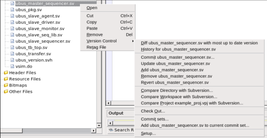
_A. Learning Curve_

All the tools mentioned are quite user friendly and have shown to be quite popular with new graduates and junior
engineers in the company, especially those who have prior software engineering experience in using well-known
IDEs such as Eclipse and Visual Studio.

Using an IDE minimizes the large learning curve typically associated with learning how to use traditional text
editors such as Emacs and Vim. This in turn reduces the time-spent training for projects and increased work
efficiency in the order of magnitude of several hours per week.

The tools can be beneficial both to someone using an IDE for the first time, or for experiences users wishing to
exercise the more advanced features. In both cases, the user benefits from the inclusion of base features such as
advanced Auto-editing, Symbol navigation etc., which is a step-up from what a traditional text editor offers straight
out of the box.

_B. Reduction of tools_

A modern hardware verification environment can be quite large and complex, with multiple mixed-language
simulators, compilers, scripts and additional debug tools in use. An IDE reduces the number of tools used by
compacting a vast array of features in a centralized environment and providing additional plug-ins and support for
new features in some cases.

_C. Support_

An increase in use and adoption of these tools for hardware verification in recent years has created a push towards
open-source efforts and commercial incentives to support verification languages in these IDEs [1]. Growing
competition between the growing numbers of IDE companies is also helping drive innovation. Informative user
guides, documentation and customer specific product support is available for all commercial IDEs.

_D. Setup Flow_

The tools have also proven to be easy-to-setup and integrate within the project workspace and are supported on
both Windows and Linux platforms. A generalized tool-setup flow consists of the following steps:

1. All Eclipse based IDEs (DVT, SVEditor, Sigasi and SlickEdit Core) require a base installation of the

Eclipse platform. This can be done in one of two steps:

a. Installing a version of Eclipse that comes pre-packaged with the SystemVerilog IDE plugin.
b. Installing the SystemVerilog IDE plugin as a stand-alone toolkit or plugin.
_Note_ : Non-eclipse based IDEs can be downloaded and installed as a standalone tool.
2. Once the tool is installed, it will require you to create a workspace when launched for the first time. A

workspace is a repository for your project information as well as any custom preferences that you set up.
Once a workspace is created, you will be directed to the GUI of the tool.
3. The next step involves loading existing project information into the tool space or creating a new project

altogether. This is usually done by accessing the ‘File’ or ‘Project’ menu and choosing the appropriate
options. Depending on the type of language chosen for the project, the tool will switch to a language
specific perspective e.g opening a SystemVerilog project will force the IDE to switch to a SV perspective
consisting of a layout/menu that best integrates with the language.
4. At this point, you need to give the IDE the information it needs to parse your design [11]. This is usually

added to the project in the form of an argument file with the ".f" extension. The “.f” file contains
pointers to all files/packages/libraries that are required for project code compilation/elaboration. A user
may manually exclude some files if you deem them useless to the project.
_Note_ : Adding an extraordinarily large number of files can significantly reduce the performance of the
IDE. For this reason, your “.f” file should only contain files that are being actively developed as well as
any dependencies. Including scripts/backup directories is not recommended.
5. This concludes the setup flow. At this point, the user may choose to add additional features to the project

space for e.g. SVEditor supports the inclusion of multiple projects within one workspace (each with its
own “.f” file). This is done by defining a singular environment variable for both projects but pointing to
two different project directories.

V. CONCLUSION
Given the complexity of modern day hardware circuits and the RTL code required to develop and verify them, it
is slowly becoming more beneficial for developers to adopt IDEs in their workflow. This paper serves to analyze
the core features and usefulness of IDEs when utilized for hardware development, with an emphasis on hardware
verification in particular. We determined that IDEs helped directly reduce the problems of code comprehension
through the use of code layout features such as syntax highlighting, auto-editing etc. [3], in addition to simplifying
debug and automating development by introducing features such as cross language and UVM debug support,
simulator and compiler integration, version control assimilation and macro programming/expansion. Given that,
developers often have to switch between multiple tools for different functional tasks, which results in loss of parts of
their mental model of the project design space [12]; IDEs prevent this by providing pre-packaged solutions to
common functionality required by code developers.

Despite the many benefits that IDEs offer and a growing community of users, more needs to be done to advertise
the usability aspect of these tools, particularly to address tool and flow setup complexity conceptions, which still
prevent the common hardware engineer from trying them out.

VI. REFERENCES

[1] C. Amitroaie and A. Betts, “Time to exploit IDEs for hardware design and verification”. 2011, pp. 1-6

[2] Accellera Systems Initiative, “Universal Verification Methodology (UVM) 1.2 Class Reference,” 2014.

[3] "Program Comprehension: Past, Present, and Future", in _2016 IEEE 23rd International Conference on Software Analysis, Evolution, and_
_Reengineering (SANER)_, Osaka, 2016, p. 1-8.

[4] SlickEdit Inc, "Slick-C Macro Programming Guide," SlickEdit Inc, 2007.

[5] I. Zayour and H. Hajjdiab, "How Much Integrated Development Environments (IDEs) Improve Productivity?", _JOURNAL OF_
_SOFTWARE_, vol. 8, no. 10, pp. 1-7, 2013.

[6] _DVT SystemVerilog IDE User Guide_, 17th ed. AMIQ, 2017, pp. 335-356.

[7] EDACafe, "AMIQ EDA Offers Enhanced UVM Support in the DVT Eclipse IDE", p. 1, 2014.

[8] EECatalog-Chip Design, "Design and Verification Tools (DVT)", p. 1, 2013

[9] "Tool Integration", _Sigasi_, 2017. [Online]. Available: http://insights.sigasi.com/manual/tools.html#launch-simulator.[Accessed: 24- Oct2017].

[10] _SlickEdit Core v4.3 for Eclipse_ .SlickEdit Inc., 2017, pp. 1-26, 510-522.

[11] “SVEditor Tutorial", _Sveditor.sourceforge.net_ . [Online]. Available: http://sveditor.sourceforge.net/tutorial/sveditor_tutorial.html.

[Accessed: 25- Oct- 2017].

[12] R. Tiarks, “What Programmers Really Do: An Observational Study”. _Softwaretechnik-Trends_, 31(2):36-37, 2011

.

